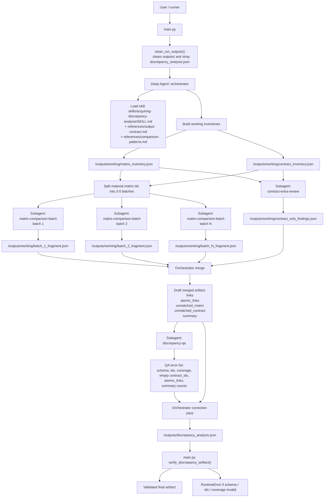
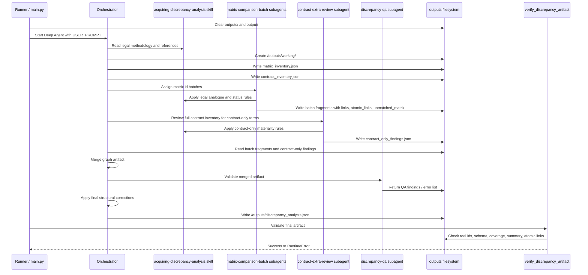

Ниже README-ready блок.





**Subagents**

| Subagent | Role | Input | Output |
|---|---|---|---|
| `matrix-comparison-batch` | Сопоставляет assigned matrix ids с договором many-to-many | `matrix_inventory.json`, `contract_inventory.json`, skill refs, batch ids | `links`, `atomic_links`, `unmatched_matrix` для своего batch |
| `contract-extra-review` | Ищет существенные пункты договора без аналога в матрице | полный `contract_inventory.json` + `matrix_inventory.json` | `unmatched_contract`: `extra_in_contract` или `not_material` |
| `discrepancy-qa` | Проверяет структуру, покрытие, ids и юридическую консистентность artifact | merged draft artifact / fragments | список ошибок; не переписывает юридический анализ |

**Final Artifact**

```text
/outputs/discrepancy_analysis.json
```

Содержит:

```text
links              grouped many-to-many legal relationships
atomic_links       row-level matrix_id + contract_id pairs
unmatched_matrix   bank-standard requirements missing in contract
unmatched_contract contract terms without matrix analogue
summary            derived counts
```